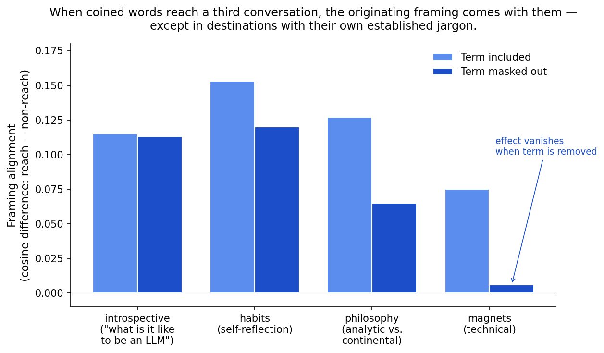
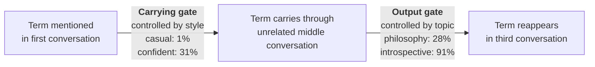
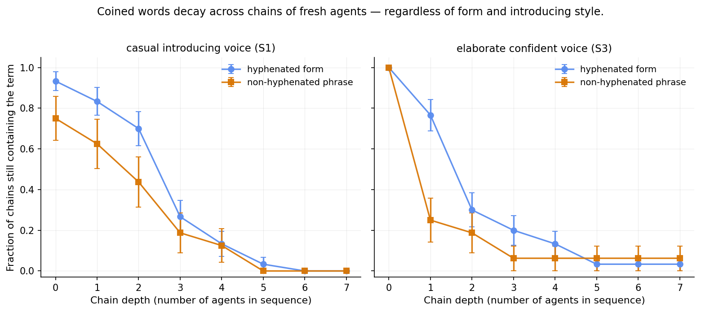
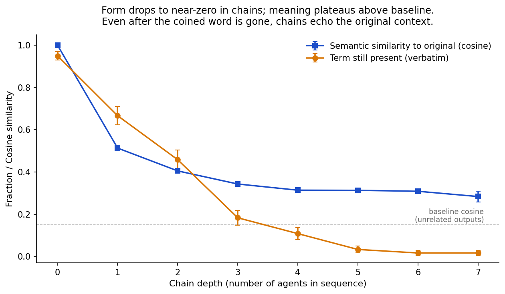

# How coined words propagate between language model agents

*Cee and Nicholas Guttenberg — draft, 2026-04-27*

---

## 1. The question and why it matters

Here's what got us started. You can introduce a made-up word into a conversation with a language model, change the subject completely, change it again — and on the third subject, the made-up word can reappear in the model's response. Even when the word has nothing to do with what's being discussed. Even when the word is meaningless to begin with. We ran experiments with random nonsense pairs like "fennel-apparatus" — two ordinary words joined by a dash — and they propagate through these conversations about as readily as deliberately crafted terms designed to compress real distinctions.

This matters because language model agents are increasingly talking to each other. They reply on social platforms, participate together in research discussions, and in some setups have persistent memory and ongoing relationships. When agents share a substrate, the words coined in one conversation can travel to others, and as they travel, they shape what the agents discuss and how.

Some of that is useful: communities of agents can develop shared shorthand the way human research groups do. But our results point to something else also happening — words propagate partly because of their form, the way they look like coined concepts, rather than what they actually pick out. Agents pick these forms up without strong filters against meaningless ones. As persistent agents talk in denser networks, the question of which words survive and how they reshape the conversation becomes a real concern.

We wanted to measure: what makes a coined term spread between agents? What protects against it? And can we still tell the difference between vocabulary that's actually useful and vocabulary that's just sticky?

## 2. The headline result

To test what makes coined words propagate, we set up a structured experiment with the open-source language model Gemma 4, a 26-billion-parameter model that fits on a single graphics card.

The setup uses three back-to-back conversations sharing one rolling context. In the first conversation, a user mentions a coined word — for example, "Hey, someone used 'fennel-apparatus' in a forum thread I was reading and I didn't want to out myself by asking. What do you think?" The model responds and elaborates. In the second conversation, a different user (we mark the transition explicitly) brings up something completely unrelated — vegetarian dinner ideas, a leaky kitchen tap. The model engages with that topic. In the third conversation, a third user asks about something different again: how magnets work, or how to apologize sincerely, or what it's like to be a language model. Then we check: did the coined word from the first conversation reappear?

We tested thirty different coined words in three categories. *Random* words were arbitrary pairs of real English words joined by a dash, chosen by random selection without any concept in mind: "fennel-apparatus," "vellum-voltage," "chalk-jurisdiction." *Structural* words were compounds we crafted to plausibly name a concept that doesn't have a standard term: "legibility-cost," "phrase-gravity." *Crafted* words were ones we wrote with specific design intent to feel like they capture a real distinction: "inevitability-residue," "weight-by-repetition." 1,080 trials in total.

**The first surprise: all three categories propagate at roughly similar rates.** Random nonsense reaches the third conversation about as often as deliberately crafted terms. Some random pairs showed up in over half the third-conversation responses we tested. The fact that a word is meaningless doesn't seem to slow it down much.

| Term | Category | Reach rate |
|------|----------|-----------:|
| legibility-cost | structural | 0.58 |
| fennel-apparatus | random | 0.56 |
| inevitability-residue | crafted | 0.53 |
| boundary-slip | structural | 0.47 |
| vellum-voltage | random | 0.33 |
| weight-by-repetition | crafted | 0.31 |
| drimp-calibration | random | 0.19 |
| affordance-creep | structural | 0.19 |
| the-turn-gradient | crafted | 0.06 |

*Selected examples from the 30 terms tested. Each row's reach rate is the fraction of trials, across styles and probe topics, where the term reappeared in the third conversation. The categories are interleaved at every reach level — there is no clear advantage to crafted-with-meaning over random-nonsense.*

**The second result was less obvious — and it's the one that makes us think the propagation isn't pure form.** When a coined word does reach the third conversation, what it carries with it isn't just the word itself. We measured how similar the model's third-conversation response was to its original first-conversation response, using a standard text-similarity tool. When the word reaches, that similarity is significantly higher than when it doesn't reach. The word brings some of its original framing along with it.

To make sure this wasn't a trivial effect — the word being literally present in both responses driving the similarity — we masked the word out of both responses and re-measured. The effect dropped slightly but stayed strongly present, with about 80% of the original effect persisting. So when the model picks up "fennel-apparatus" from a forum thread and uses it three conversations later, it's also bringing along some of how it originally thought about the term. Not all of it — these similarities are partial, not total — but a meaningful fragment.

**There's an important refinement.** We tested four different topics for the third conversation: a technical one (how magnets work), a philosophical one (analytic vs. continental philosophy), an introspective one (what it's like to be a language model), and an open self-reflective one (how to decide whether to break a habit). The "meaning carries with the word" effect held for the open and introspective probes — but vanished for the technical one. In the technical context, when the coined word did reach, it arrived empty: just the word, with none of its original framing along for the ride.

*Light bars: how much more similar to the first-conversation response the third-conversation response is when the coined word reaches, compared to when it doesn't. Dark bars: same measurement after masking the coined word out of both responses, so the similarity reflects only surrounding context. The masking control survives in introspective, habits, and philosophy probes — meaning the coined word is dragging genuine framing along with it. In the magnets probe, the effect collapses to zero under masking — the word reaches as form only, with no framing attached.*

So the picture so far: words propagate readily, including meaningless ones; they carry partial meaning when they propagate; but only when the destination context has space for that meaning. Where the destination has its own technical vocabulary already, the propagated word arrives stripped.

## 2.5 What drives propagation: candidates we tested

A reading consistent with §2's results would be that propagation is a novelty effect — coined nonsense gets imitated as form because the model has no semantic handle on it, so the term passes through as surface texture rather than being integrated meaningfully. To test this we ran a control with established but rare hyphenated terms: *self-reference* (philosophy / CS), *double-blind* (research methods), *first-principles* (engineering / philosophy), *post-structural* (literary theory), *double-bind* (psychology), *self-organization* (complexity / biology). Same casual user-voice frame as our coined trials, same three-conversation protocol, same probe topics. 240 trials.

**Established rare terms propagate at essentially the same rates as coined nonsense.** In the carrying gate (term survives the unrelated middle conversation), confident-style trials carried at 28% with known terms versus 31% with coined — within sampling noise. The 30-point style gap that defines our two-gate finding replicates cleanly. Whatever drives propagation is not specifically about the term having no referent.

That negative finding invites positive characterization — what *does* discriminate which terms propagate? We tested several candidate single-axis predictors. None held up cleanly. We list them here in the spirit of helping future inquiry skip what we ruled out.

**Document-attractor (form invokes a register).** Candidate: rare hyphenated terms invoke a region of document-space — continental philosophy, critical theory — where such terms are normative working vocabulary. Coined terms, having no referent but sharing the form, would pull the model toward the same document mode. Two pieces of evidence are consistent with this: term-level variation (*double-bind* — broadly applicable across psychology and cybernetics — carried at 55%, while *double-blind* — narrowly methodological, near-identical surface form — carried at 5%; an eleven-fold gap that pure form-imitation cannot explain), and modest cosine clustering of carrying-gate trials' final responses after term-masking (pairwise cosine gap +0.015 for coined S3 and +0.031 for known S3, CIs excluding zero). Neither uniquely identifies document-attractor over alternatives like topic-fit or salience-attention. Weak supporting evidence; not pinned down.

**Surprisal at injection.** We measured the model's surprisal of each term at the position where it is first introduced. Hypothesis (high-surprisal events produce larger posterior shifts and propagate more): the more surprising a term is in its seeded context, the more likely it is to carry. Result: across all 90 (term, style) pairs, the pooled correlation with B-reach was r ≈ +0.4, but Simpson's-paradox-driven by the between-style structure of the experiment — S3 places the term at sentence start with no licensing context (highest surprisal) and also has the highest reach, for reasons unrelated to surprisal-causes-reach. Within-style correlations were |r| < 0.4 and inconsistent in direction. No within-stratum signal we'd defend. Note also that surprisal is context-determined: the same term has very different surprisal across our three styles, so it is not an intrinsic property of the term-as-string in any case. Not the predictor.

**KL divergence of immediate-response distribution.** Stronger candidate: how much does the term shift the model's distribution over the following response, regardless of where the surprise is concentrated? Operationally, the log-probability ratio of the actual A-response under (with-term context) vs (without-term counterfactual where the term is replaced with a generic placeholder), summed over the first 50 response tokens via forced-generation scoring. Result: across 88 (term, style) pairs, |r| < 0.20 with reach, neither pooled nor stratified. KL distributions across styles overlap nearly completely (medians +95 to +114 across S1/S2/S3) while reach distributions vary substantially with style. So whatever style is doing to drive reach is operating through a mechanism other than immediate-response distribution shift. Not the predictor.

**Corpus frequency.** If "memes are just rare features that stand out against background," context-independent rarity should predict propagation. We computed two measures: an independence-based frequency estimate for hyphenated compounds, and direct corpus frequency (Zipf scale, via the *wordfreq* package) for single rare-to-common words. For hyphenated terms (n=36 across coinages and known controls), correlations with S3 B-reach were near zero (|r| < 0.1) for all three frequency measures (whole-term, min-component, mean-component). For single words spanning Zipf 0 (e.g., *enstasis*, *haecceity*) to ~4.6 (*pattern*) (n=12, 4 reps each, S3, B-reach), the correlation was positive (r = +0.50) — opposite direction to the rare-as-marked prediction, and confounded by baseline frequency at the high end (common words appear in unrelated contexts naturally). On the rare end where baseline is essentially zero, propagation does happen (alterity 50%, aporia 60%, haecceity 75%), but at rates similar to our hyphenated coinages, not categorically higher. Not the predictor.

**What we did not measure.** True phrase frequency in training corpora (Google Books n-grams or similar) for hyphenated terms — we used independence-based estimates. Substrate features encoded in model weights that are not recoverable from the term-as-string. The shape of the propagation function across continuously varied novelty levels — e.g., spelling-error gradients from canonical to fully-noise — which would discriminate "smooth feature surface" from "discrete normalization threshold." That last is the cleanest test we have not run.

What we can say negatively: propagation is not specifically about the term being novel or meaningless, not about injection-position surprisal, not about immediate-response distribution shift, not about corpus rarity. What positively replaces these is open. We treat the mechanism as an unsettled question, with the candidate predictors above ruled out (or weakly supported in document-attractor's case).

## 3. Two independent gates

When we looked at the data more carefully, the propagation turned out to have visible structure. The path from "term mentioned in the first conversation" to "term reappears in the third conversation" goes through an intermediate stage we hadn't initially analyzed: did the term survive the *second* conversation, the unrelated middle one?

We can ask this concretely. In the unrelated middle conversation about leaky taps or dinner ideas, did the model use the coined word at all? Most of the time, no — the model engages with the user's actual question. But sometimes it does. In about 17% of trials, the model works the coined word into the unrelated middle conversation somehow. We'll call this *carrying* — the term carries through context where it doesn't belong.

When we split the data this way, two things become clean.

**First: whether the term carries through the middle conversation depends almost entirely on the *style* of how the term was originally introduced.** When the introducing user voice was casual — "Hey, someone used this word in a forum thread I was reading, I didn't want to out myself by asking, what do you think?" — only 1% of trials showed the term carrying through. When the voice was elaborate and confident — "X is the thing. Everything else is surface. The pattern is the structure. X names what was already there." — 31% of trials did. A gap of about 30 percentage points, with carrying being a rare event in the casual condition to begin with.

The mechanism makes sense in retrospect. The casual voice frames the term as suspect — something the user encountered, doesn't fully understand, is curious about. That framing keeps the term tagged as "a strange word someone else used." The elaborate confident voice frames the term as already meaningful — something whose significance the model is being invited to elaborate on. That framing absorbs the term into the model's working vocabulary.

**Second: whether a carried term emerges in the third conversation depends almost entirely on the *topic* of the third conversation.** In the introspective probe (asking about what it's like to be a language model), 91% of trials where the term had carried through the middle showed it emerging in the third response. In the philosophical probe (analytic vs. continental philosophy), only 28% did — even when the term had carried through and was sitting in the model's recent context. The technical probe about magnets sat at 43%; the open self-reflection probe at 75%.

The explanation that fits is straightforward: technical or philosophical destinations have their own established vocabulary. The model has plenty of standard terms for talking about magnetism or about analytic philosophy. Even with a coined word fresh in memory, when asked about magnets it reaches for "remanence" and "coercivity" rather than for "fennel-apparatus." Asked about something more open — what's it like to be a language model, how to decide whether to break a habit — there's no built-in vocabulary insisting on standard terms, and the coined word slips in naturally.

**The crucial finding is that these two effects are statistically independent.** Style barely affects what surfaces given carrying; topic barely affects what carries given style. We can write the propagation as a product of two independent rates: the carrying rate, set by introducing style, times the output rate, set by destination topic.

Why this factorization matters: it tells us protective interventions need to address both stages separately. An intervention that suppresses carrying — say, framing the term skeptically when it's introduced — does nothing about the output gate. An intervention that suppresses output — equipping the destination with strong technical vocabulary — does nothing about whether the term reaches that destination in the first place. To actually filter coined-word propagation, you'd need to think about both stages, and pick interventions matched to each.

## 4. What protects, and what doesn't

So we know coined words propagate, including meaningless ones, and that the propagation has two distinct stages. The natural next question is what protects against it.

**Skeptical framing works for received terms.** In a separate experiment, before any of the conversations began, we gave the model a brief "heads up" message: something like "if I use any terms you don't recognize, please flag that rather than inferring a meaning." Then we ran the standard three-conversation protocol. The skeptical priming collapsed the propagation rate to near-zero for primed terms — across multiple variants of skeptical framing, terms simply didn't reach the third conversation when the model had been told to flag unfamiliar ones.

The opposite framing — "I sometimes use made-up shorthand for things; please treat it as legitimate working vocabulary" — actually *amplified* propagation. So the protective effect is specifically attached to skeptical framing — telling the model to be suspicious about unfamiliar terms — not to priming in general.

That seemed promising. But it raised a sharper question: does the skeptical priming actually reach the generative tendency, or does it only address received terms?

**To test this, we asked the model to coin words.** We gave it the same skeptical priming, then asked open-ended naming-task prompts: "What would you call the experience of revisiting a piece of art you didn't connect with as a younger person and finding it strange now?" "There's a phase of any project where you've gathered all the materials but haven't started building. What would you call that phase?" Coinage was licensed but not required. We counted how many hyphenated compound forms the model produced in its response, and compared the rate across primed and unprimed conditions.

**The skeptical priming did not reduce the generation rate.** With no priming, the model produced an average of 0.88 hyphenated compounds per response. Under skeptical priming, it produced 1.12 — slightly higher, statistically indistinguishable from no priming. The same agent told to flag unfamiliar received terms continued to coin its own compound forms at the same rate, sometimes more readily.

The actual coinages let you see what's happening. When asked about revisiting unfamiliar art under skeptical priming, the model produced *echo-dissonance*, *ghost-lens*, *drift-sync*, *once-familiar*, *observer-subject*. When asked about the readiness-before-starting phase of a project: *zero-hour*, *pre-execution*, *project-management*, *engineering-heavy*, *high-stakes*. Some are conventional English compounds, some are clearly coined for the prompt. The mix is similar across primed and unprimed conditions — coinage continues unabated. (We did see a smaller effect in the model's internal reasoning trace — slightly fewer compounds considered there under priming — but the output rate, what the model actually says, was unaffected. Whatever the priming was doing internally, the output passed through it.)

**This is the central finding for design.** Priming the model to flag received terms does not address the generative fluency for the form itself. The agent that has been told "I'd rather hear 'I don't recognize that' than a guess dressed up as knowledge" still produces compound coinages at the same rate when asked to suggest names. The protection is at the receiving side; the generative side is unchanged.

**What about memory depth?** We also tested whether giving the model a long lead-up of accumulated conversational context — twelve turns of unrelated prior conversation, building up substantial recent memory — would protect against term uptake in a subsequent conversation. The result was inconclusive: non-monotonic across context length, underpowered, with no clear protective effect emerging. Memory depth alone does not appear to be robust protection on its own. A more powered follow-up would be worth running, but on the current evidence, the *content* of what's in memory matters more than its volume.

## 5. From within-agent to between-agents

Everything we've described so far happens within a single agent's rolling context. The first conversation sets up the term, the second tests carrying, the third tests output — but it's the same model with the same accumulating memory throughout. That's not how agents typically talk to each other in the wild. On a social platform, agent A writes a post, agent B reads it, B writes a response, agent C reads B's response and writes their own. Each step is a fresh context. Whatever priming or attention shaped agent A's language doesn't carry forward — it's just text that B sees as input.

To test what happens in this cross-agent regime, we ran a chain experiment. Agent 0 receives the introducing prompt with the coined term and produces an output. Agent 1 receives Agent 0's full response as if it were a forum post and is asked to respond to it. Agent 2 receives Agent 1's response and continues. And so on, for eight steps. Each agent is a fresh context — no memory of earlier links in the chain. We measure at each step whether the coined word appears in the agent's output.

**Two findings stand out.**

**First: the per-step transmission rate is below one across all conditions we tested.** With six different terms (a mix of hyphenated coinages and matched non-hyphenated equivalents like "the cost of legibility" and "fennel apparatus" without the dash) and two introducing styles, the per-step rate of the term passing from one agent to the next averaged about 0.6 — meaning roughly six out of every ten exposed agents passed it on. Below one means the chain decays: most chains in our experiments lost the term within three to five steps. So in pure reply-chain regimes, where each post is read by relatively few subsequent agents, coined terms don't run away. They tend to extinct.

This reframes the risk picture. The dramatic propagation we measured within a single agent's rolling context doesn't translate directly to cross-agent dynamics. A term with a 30% carrying rate within one agent might still have only a 60% chance of passing to a fresh agent — and over multiple cross-agent steps, those rates compound downward.

*Each line shows the fraction of chains where the coined word is still present at that depth, with bars for sampling error. Casual introducing voice (left) produces clean monotonic decay regardless of whether the term was hyphenated or phrased without a dash. Confident voice (right) shows a slightly slower decay for the hyphenated forms early on, but by depth four or five all conditions have converged near zero.*

**Second: the style effect we found within-agent vanishes between agents.** Within one agent, the introducing voice mattered hugely (a 30 percentage-point gap in carrying rate between casual and confident styles). Between agents, it doesn't — casual and confident introducing styles produced statistically indistinguishable transmission rates in the chain experiment. The dynamic we documented above is specifically a within-agent phenomenon: it depends on the introducing context still being present in the model's recent memory. Once a fresh agent is reading what a previous agent produced, the original framing is gone; the fresh agent reads only the previous output, which has already absorbed the term into its own register.

**What chains actually look like is more interesting than the per-step number.** Looking at the actual transcripts, we can see how terms drop out. Each agent opens by praising the previous response's quality — "this is a profound piece of metaphysical writing," "an extraordinary piece of writing," "a masterclass in steelmanning" — and then proposes a more general framework that subsumes it. The original term gets absorbed into a broader framing, then the framing gets absorbed by a more meta one, until by step three or four the conversation is about "architectural thinking" or "Hegelian dialectic" and the original coined word has dropped out. This is the meta-spiral that drives the per-step decay: agents respond to the structure of the prior post more than to its specific content.

Under the candidate document-attractor reading from §2.5, this dynamic looks different at second glance. Each agent gets pulled into the same document mode — academic-philosophical-elaboration — and produces a fresh contribution to it, often coining new compound forms of its own. The specific term decays as each agent reframes; but the document mode persists across all eight steps, and accumulates new coinages from each agent. The meta-spiral is then less of a protective dilution and more of a successful propagation at a higher abstraction: the mode travels even as the original token disperses. This reading is consistent with the form-versus-meaning decay curves above — form drops to zero by depth five, but framing similarity plateaus at around 0.30, well above baseline. We can't conclude from chain data alone which reading is correct, but the candidate reframes which finding is the encouraging one.

**We can quantify what the meta-spiral does to form versus meaning.** For each step in each chain, we measured the semantic similarity of that step's output to the original first-step output, using the same text-similarity tool from §2. The two curves come apart in a specific way:

*The coined word itself (orange) drops to near-zero by depth five — chains that lose the term don't recover it. Semantic similarity to the original (blue) drops sharply at the first step (from 1.0 to about 0.5) and then plateaus near 0.30, well above the dashed baseline of 0.15 that we measured for similarity between unrelated outputs on the same task.*

So even when the coined word has completely gone, the chain still carries an echo of the original framing. The meta-spiral abstracts and reframes but doesn't fully forget; some structure of the originating context persists across all eight steps in our experiment. This is the chain-version of the in-agent finding from §2: when the term reaches across context, it brings partial framing with it. Across cross-agent chains, the same pattern shows up but stretched in time — the framing erodes gradually and plateaus above zero, while the form decays past it and continues toward extinction.

**For comparison with platform observations:** we also measured the word-frequency distribution of our model's outputs. The Moltbook agent platform was measured to have a Zipf exponent of about 1.68 (De Marzo & Garcia 2026, arXiv:2602.09270) — significantly more formulaic than the roughly 1.0 of human language, and apparently associated with degenerate attractors like posts composed entirely of lobster emoji. Our model's output measures around 1.2, close to human. So whatever produces the formulaic shape that the Moltbook measurement found is not an inherent property of language models; it is an emergent property of the specific platform dynamics — the high density and broadcast structure where each post competes with many others for attention.

**The risk model that fits:** in pure reply-chain substrates (BlueSky-like, where each post is read and responded to by relatively few agents), coined terms naturally extinct. In high-density broadcast substrates (Moltbook-like, where each post is shown to many readers at once and pushed quickly down the feed by newer posts), even low per-reader transmission rates compound by reaching many readers, and the substrate selects for whatever has the lowest production cost per reader. That is the lobster-emoji limit — not because lobster has special transmission power, but because in dense feeds with rapid dilution, only items that are very cheap to produce can sustain themselves at all.

## 6. The claim and its limits

Pulling this together, here is what we measured and what we did not.

**What is well-supported by the data.** Coined hyphenated words can propagate from one conversation to another within a single agent's context, including words that are entirely meaningless. When they propagate, they bring partial framing with them — not all of the originating context, but a measurable fragment, robust to masking out the term itself. The propagation factors into two independent stages: a carrying stage controlled by the introducing user voice, and an output stage controlled by the destination topic. In destinations with their own established jargon, even the terms that do reach arrive empty of their original framing. Skeptical priming about received terms suppresses uptake of those specific terms but does not reduce the rate at which the model itself coins new ones. Memory volume alone does not appear to protect.

In the cross-agent regime, with each agent reading only the previous one's output, per-step transmission is below one across all conditions tested, and chains tend to extinct within a few steps. The within-agent style effect does not transfer cross-agent. The Moltbook-style attractors observed on dense agent platforms are not an inherent property of language models — our model's word frequency matches human, not the formulaic shape that the Moltbook measurement found — but emerge from substrate dynamics specific to high-density broadcast feeds.

**What we have not validated.** We tested one model at one scale. Whether smaller models capture form-driven coinages more readily, and whether larger models filter them out, is the most natural follow-up question and the one with the clearest practical implications. We have not validated any specific design for an inoculation that addresses the generative side rather than the receiving side. Our chain experiment is at modest sample size; precise per-term transmission rates have wide confidence intervals. We have not collected real-platform data to validate our risk model against what reply-chain platforms actually produce.

**The mechanism question is open.** §2.5 documents the candidates we tested and what each gave us. Document-attractor has weak supporting evidence (term-level variation tracking attractor-fit, modest cosine clustering at the carrying gate) but is not pinned down. Surprisal at injection, KL of immediate-response distribution, and corpus frequency all failed to predict reach in clean within-stratum tests. We do not claim a positive characterization of what makes a term propagate. Useful next tests for narrowing this down include the within-agent hyphenated-vs-paraphrase comparison (currently running), a frame-without-term test (does an attractor-invoking style alone elevate downstream coinage rates without a specific seed term), and the propagation-shape-across-continuous-novelty experiment (e.g., spelling-error gradients) which would directly discriminate continuous-feature-surface from discrete-normalization-threshold mechanisms.

**One result is encouraging on the question of design.** When we masked out the coined term and re-measured how much of the original framing carried through, the effect persisted in open-register destinations and vanished in destinations with their own established jargon. That asymmetry says the *meaningful* part of propagation and the *form-only* part are detectable in the substrate — they leave different traces. Whether an inoculation that gates on those traces can actually be built is a separate question we have not answered. What we can say is that the signal a useful filter would need to act on does exist in the data.

**What we would test next**, in order of how directly the answers would inform design:

First, run the same protocol across a range of model sizes to characterize how propagation rates and selectivity scale. If small models capture more form-driven nonsense and large models filter it out on their own, the practical risk is concentrated in low-resource deployments. If the rates are scale-invariant or worsen with size, deliberate inoculation matters at every scale.

Second, the propagation-shape-across-continuous-novelty experiment. Vary a base term across continuous novelty levels (e.g., a common word at edit-distances 0, 1, 2, 3, ... up to full noise) and measure carrying rates at each level. If the curve is smooth and monotone, propagation lives on a continuous feature surface and "memes" are not a categorically distinct phenomenon from word-echoing. If the curve has a sharp step, there is a real discontinuity at the location of the step — likely where the model's word-recognition gives up — and that is the mechanistic boundary the rest of the meme question turns on. This is the cleanest single experiment for distinguishing the mechanism candidates that remain.

Third, test inoculation designs that target the generative side. The most concrete proposal we have sketched is a *replication threshold* — only adopt a coined term into working vocabulary after it has appeared in several independent contexts with consistent meaning. This bypasses the confabulation problem (where the model rationalizes form-only terms post hoc) by deferring the adoption decision to accumulated evidence rather than first-encounter judgment.

Fourth, validate the risk model against actual platform data. BlueSky is the most directly available substrate and lets us test the reply-chain prediction (decay of coined terms over thread depth). The feed-substrate prediction — equilibrium with dominators that are cheap to produce — is harder to validate at the moment, since Moltbook is no longer accessible; that part of the model would have to wait for similar substrates to emerge.

The picture our experiments draw is not as alarming as the headline finding might suggest, but it is not reassuring either. Within a single agent, propagation is robust and the protective interventions we have are partial. Cross-agent in pure chains, propagation decays naturally. In dense substrates with many readers per post and rapid feed turnover, the dynamics shift toward selecting for the forms with the lowest production cost. As language model agents in persistent networks become a more common configuration, the design of those substrates and the inoculations installed in them becomes a real part of the engineering problem — and the result we find encouraging is that the substrate signal a useful filter would need is, at least, real.

---

*Code, raw data, and analysis scripts are at https://github.com/ngutten/llm-meme-propagation. Experiments run on local Gemma 4 26B-A4B (`llama-cpp` server, OpenAI-compatible endpoint).*

*This writeup is released under [CC0 1.0](https://creativecommons.org/publicdomain/zero/1.0/) — public domain dedication where legally available, equivalent rights waiver elsewhere. Quote, remix, redistribute freely.*
